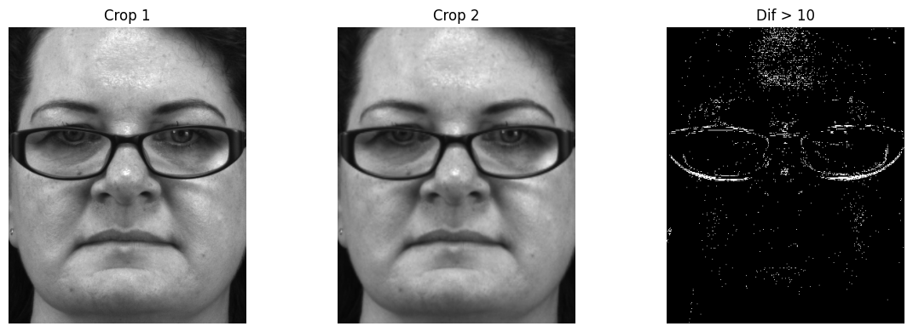
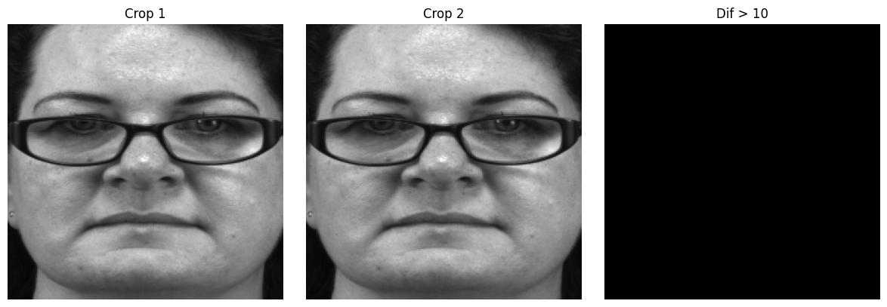
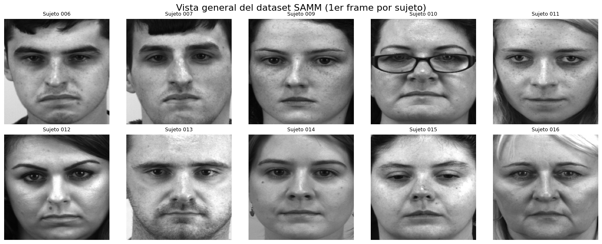
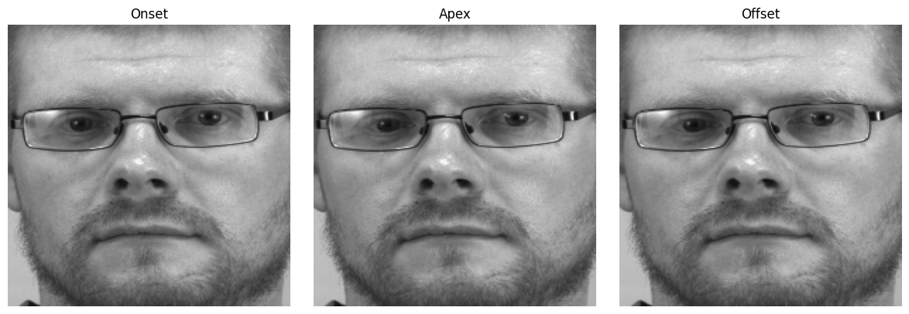
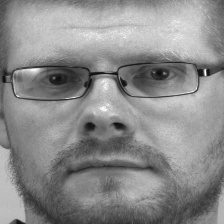
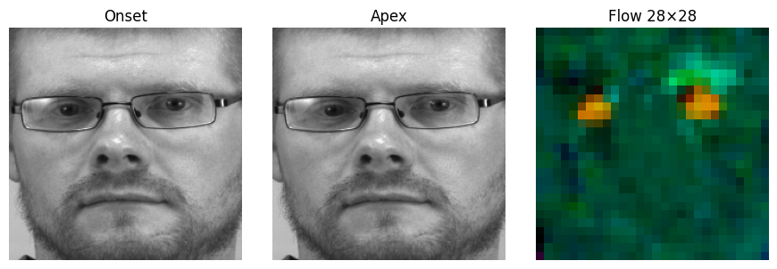
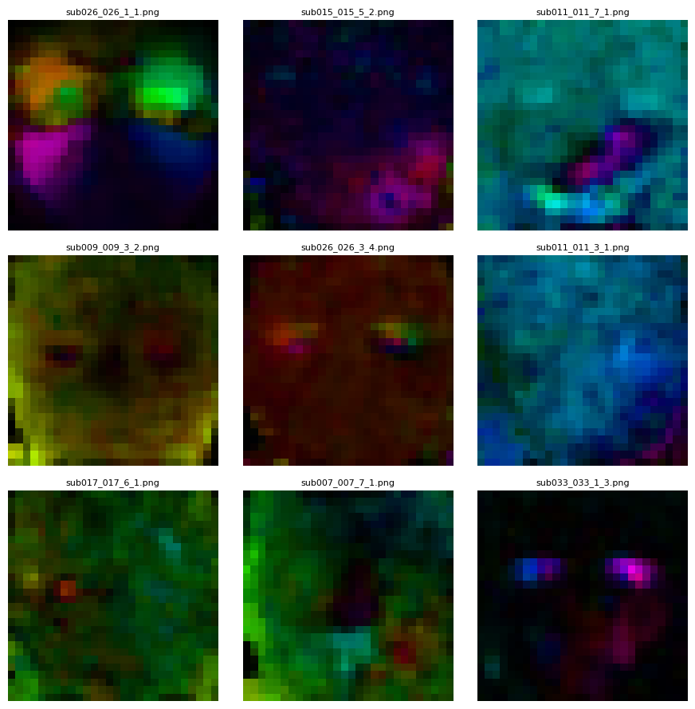

# SAMM-OptFlow-28×28: Scientific Pipeline Overview

This repository implements a streamlined, reproducible workflow to extract robust micro-expression features from the SAMM dataset. Rather than exposing every line of code, we present here the **key stages** and **results**, illustrated with representative figures.

---

## 1. Face Normalization by Template Matching

Before any motion analysis, we must ensure that every face crop in a sequence shares **identical position, scale and orientation**.  

1. **Initial detection** with MTCNN yields slightly jittery bounding boxes.  
2. **Template matching** fixes the crop region once (on the apex frame) and re-uses it for all other frames.

  

*Figure 1. pixel-wise difference between two MTCNN crops (spurious edges).*

  

*Figure 2. after template matching, alignment removes all false edges.*

---

## 2. Dataset-Wide Normalization

Applying the above to every subject and clip produces a fully aligned dataset, `SAMM_Normalized_TM`, where all faces are in register:

  
*Figure 2. First frame of each sequence, post-alignment. Uniform framing is critical to avoid introducing spatial noise into motion features.*

---

## 3. Micro-Expression Segmentation

The SAMM annotations (`samm.csv`) precisely label three key instants per event:

- **Onset**: first hint of muscular movement.  
- **Apex**: peak intensity of the expression.  
- **Offset**: relaxation back to neutral.

By focusing **only** on onset→apex, we capture the **most informative dynamic** while discarding redundant frames.

---

## 4. Dense Optical Flow Encoding

Between onset and apex, we compute a **dense 2-channel flow field** (direction + magnitude). This field is visualized in HSV and converted to a **28×28 RGB map**, which:

- **Encodes direction** via hue.  
- **Encodes magnitude** via brightness.  
- **Compresses** high-resolution motion into a small, model-friendly image.

  
*Figure 3. Randomly selected 28×28 flow maps highlighting subtle facial movements.*

---

## 5. Onset→Apex Animation

To emphasize the dynamic change, we can animate the transition:

  

    
    
<em>Figure 4. Animated progression from neutral onset to peak expression.</em>

---

## 6. Dense Optical Flow Encoding

After aligning faces and selecting onset & apex frames, we automatically generate the optical‐flow maps for every clip:

1. **Batch processing** via our `SAMMFlowProcessor` reads the `samm.csv` annotations.
2. For each sequence, it locates the normalized onset and apex crops.
3. Computes the dense Farnebäck‐inspired flow field (direction + magnitude).
4. Encodes it as an HSV image → converts to RGB → resizes to **28×28**.
5. Saves one PNG per clip in `samm_flow_pngs/`.

